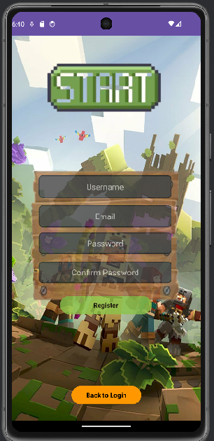

# labNhom

Đây là một dự án ứng dụng Android đơn giản bao gồm chức năng đăng nhập, đăng ký tài khoản được kích hoạt bằng OTP qua email và quên mật khẩu bằng OTP qua email.

# ảnh chụp màn hình

| Màn hình đăng nhập | Màn hình đăng ký | Màn hình OTP | Màn hình quên mật khẩu |
| :---: |:---:|:---:|:---:|
|  |  |  |  |

## Tính năng

*   **Màn hình đăng nhập:** Cho phép người dùng đăng nhập bằng thông tin tài khoản của họ.
*   **Màn hình đăng ký:** Cho phép người dùng mới đăng ký tài khoản.
    *   **Xác minh OTP:** Tài khoản mới được kích hoạt thông qua mã OTP được gửi đến địa chỉ email của người dùng.
*   **Quên mật khẩu:** Cho phép người dùng đặt lại mật khẩu thông qua mã OTP được gửi đến địa chỉ email của họ.
*   Điều hướng cơ bản giữa các màn hình.

## Cài đặt

1.  Clone repository này.
2.  Mở dự án trong Android Studio.
3.  Chạy ứng dụng trên trình giả lập hoặc thiết bị vật lý.
